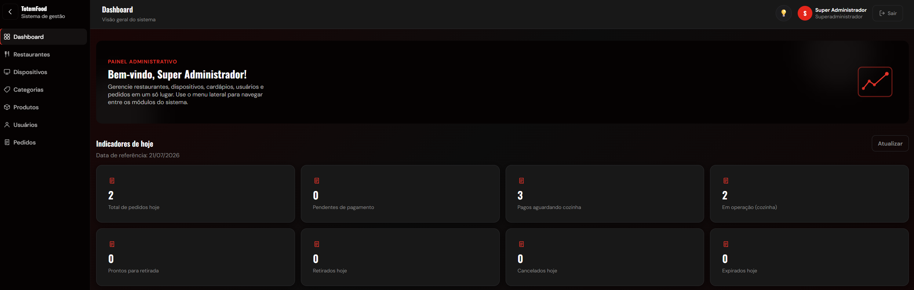
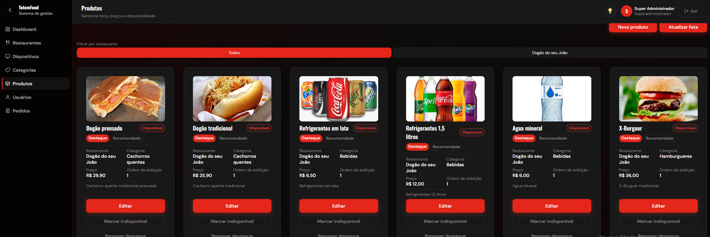
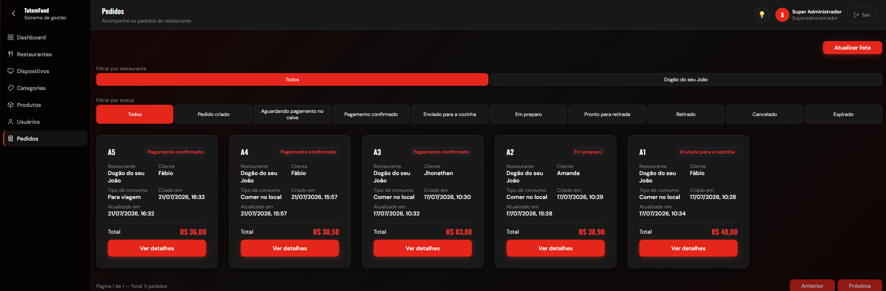
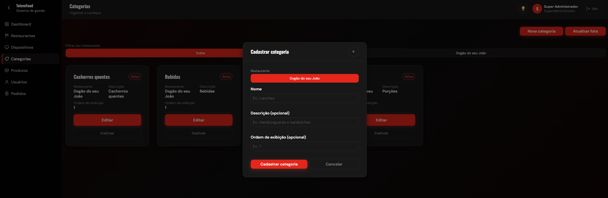
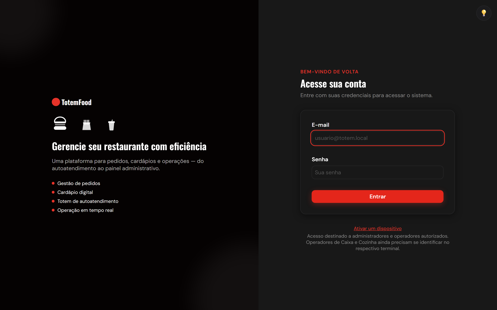
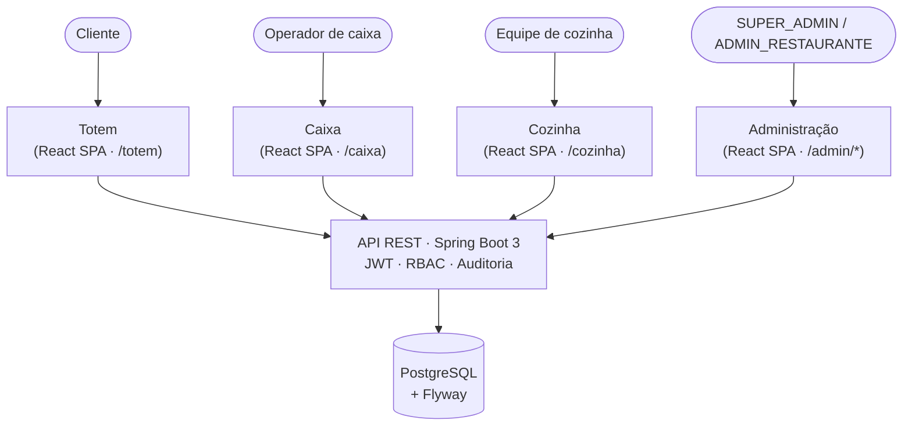

# Sistema de Totem de Autoatendimento para Fast Food

[](https://github.com/FabioSimones/TOTEM-2026/actions/workflows/ci.yml)


Sistema full stack de autoatendimento e operação para restaurantes fast food: o cliente monta e paga o próprio pedido em um totem, enquanto Caixa, Cozinha e um Painel Administrativo operam o fluxo completo — pagamento, preparo, retirada, cardápio, dispositivos e usuários — sobre a mesma API.

## Sumário

- [Sobre o projeto](#sobre-o-projeto)
- [Capturas de tela](#capturas-de-tela)
- [Arquitetura](#arquitetura)
- [Funcionalidades por módulo](#funcionalidades-por-módulo)
- [Stack tecnológica](#stack-tecnológica)
- [Segurança](#segurança)
- [Design System e acessibilidade](#design-system-e-acessibilidade)
- [Testes e qualidade](#testes-e-qualidade)
- [CI/CD](#cicd)
- [Como executar localmente](#como-executar-localmente)
- [Estado atual do projeto](#estado-atual-do-projeto)
- [Metodologia de desenvolvimento com IA](#metodologia-de-desenvolvimento-com-ia)
- [Documentação complementar](#documentação-complementar)
- [Licença](#licença)
- [Autor](#autor)

## Sobre o projeto

Em operações de fast food, filas no caixa, dependência total de atendentes e falhas de comunicação entre pedido/pagamento/preparo geram lentidão, pedidos incorretos e perda de produtividade. Este sistema resolve isso separando claramente quatro papéis, cada um com sua própria interface, mas operando sobre a mesma base de dados e as mesmas regras de negócio:

| Interface | Quem usa | O que faz |
|---|---|---|
| **Totem** | Cliente final | Visualiza o cardápio, monta o pedido, escolhe forma de pagamento e acompanha o status — sem depender de um atendente. |
| **Caixa** | Operador de caixa | Confirma pagamentos em dinheiro, envia pedidos pagos para a cozinha, marca a retirada. |
| **Cozinha** | Equipe de preparo | Recebe só pedidos já pagos, organiza a fila de preparo e avança o status até "pronto". |
| **Administração** | `SUPER_ADMIN` / `ADMIN_RESTAURANTE` | Gerencia restaurantes, cardápio, dispositivos, usuários e acompanha um dashboard operacional. |

Todo o fluxo operacional segue: **Totem → Pagamento → Caixa → Cozinha → Retirada**, com auditoria de qual operador e qual dispositivo físico executou cada transição de status.

## Capturas de tela

<p align="center">
  
</p>

<table>
  <tr>
    <td></td>
    <td></td>
  </tr>
  <tr>
    <td align="center">Produtos — cardápio com imagens, preços e destaque</td>
    <td align="center">Pedidos — consulta administrativa por status</td>
  </tr>
  <tr>
    <td></td>
    <td></td>
  </tr>
  <tr>
    <td align="center">Categorias — organização do cardápio</td>
    <td align="center">Login — acesso centralizado de administradores e operadores</td>
  </tr>
</table>

As capturas acima cobrem o Painel Administrativo e o login. As interfaces operacionais (Totem, Caixa, Cozinha) exigem uma sessão de dispositivo/operador que ainda não pôde ser gerada neste ambiente. O inventário completo — o que já existe, origem de cada imagem e o que falta — está em [docs/screenshots/README.md](docs/screenshots/README.md).

## Arquitetura

Monolito modular com quatro interfaces (SPA única em React, com rotas dedicadas por módulo) consumindo uma única API REST em Spring Boot, persistindo em PostgreSQL versionado por Flyway.



**Modelo de autenticação — três sessões independentes**, cada uma com seu próprio namespace de armazenamento no frontend, sem compartilhar chaves entre si:

| Sessão | Quem autentica | Refresh token | Uso |
|---|---|---|---|
| **Usuário** | Pessoa administrativa (login e senha) | Sim | Painel Administrativo |
| **Dispositivo** | Terminal físico (Totem/Caixa/Cozinha), ativado por código | Sim | Todas as chamadas do terminal |
| **Operador** | Pessoa identificada dentro de um terminal já ativo | Não (token curto) | Auditoria de quem executou cada ação no Caixa/Cozinha |

## Funcionalidades por módulo

### Totem
- Cardápio por categoria com busca local, sidebar colapsável (desktop) e drawer (mobile).
- Seleção de produto com quantidade e observação antes de confirmar.
- Revisão do pedido, escolha de tipo de consumo (local/viagem) e criação do pedido.
- Pagamento simulado (Pix/cartão com aprovação automática; dinheiro fica pendente para o Caixa) e acompanhamento de status.

### Caixa
- Lista de pedidos pendentes com ação sugerida (confirmar dinheiro, enviar à cozinha, marcar retirado).
- Cancelamento de pedido não pago.
- Identificação de operador humano dentro do terminal.

### Cozinha
- Fila de preparo — só recebe pedidos com pagamento confirmado.
- Avanço de status (`EM_PREPARO` → `PRONTO`).

### Administração
- Restaurantes, categorias, produtos (com upload de imagem), dispositivos, usuários e pedidos (consulta paginada).
- Dashboard com indicadores operacionais do dia.
- Escopo por restaurante para `ADMIN_RESTAURANTE` — cada administrador de restaurante só vê e altera dados do próprio restaurante; `SUPER_ADMIN` vê todos.
- Controle de acesso por perfil (`SUPER_ADMIN`, `ADMIN_RESTAURANTE`, `OPERADOR_CAIXA`, `OPERADOR_COZINHA`), reforçado no backend independentemente do que a UI exibe.

## Stack tecnológica

| Camada | Tecnologias |
|---|---|
| **Backend** | Java 21 · Spring Boot 3.3.5 · Spring Security · Spring Data JPA · JWT (`jjwt`) · PostgreSQL · Flyway · Maven · springdoc-openapi (Swagger UI) · Spring Boot Actuator |
| **Frontend** | React 19 · TypeScript · Vite · React Router · CSS próprio (sem framework de UI) · react-icons |
| **Testes** | JUnit 5 + Testcontainers (backend) · Vitest + Testing Library (frontend) · Playwright (E2E mockado e integrado) |
| **Qualidade** | oxlint (frontend) · GitHub Actions (CI) |
| **Infraestrutura local** | Docker Compose (PostgreSQL) |

## Segurança

- **Autenticação stateless via JWT**, com access token + refresh token separados por sessão (usuário, dispositivo e operador — ver seção de arquitetura).
- **Fail-fast de configuração**: a aplicação **não sobe** sem `JWT_SECRET` (mínimo 32 caracteres, validado no startup) nem `CORS_ALLOWED_ORIGINS` (nunca aceita `*`) configurados — em vez de cair silenciosamente em um valor padrão inseguro, o backend recusa iniciar com uma mensagem clara.
- **Controle de acesso por perfil** (`@PreAuthorize` no backend, reforçado por rota no frontend) e **escopo por restaurante** para `ADMIN_RESTAURANTE`.
- **Auditoria**: cada transição de status de pedido registra qual operador e qual dispositivo a executou (`HistoricoStatusPedido`).
- **Rate limiting** de tentativas de login (por e-mail + IP, em memória — ver limitações).
- **Observabilidade mínima**: apenas `/actuator/health` e `/actuator/info` expostos publicamente; nenhum outro endpoint do Actuator é roteável.
- Detalhamento completo em [`docs/04-seguranca.md`](docs/04-seguranca.md).

## Design System e acessibilidade

Design System próprio (sem biblioteca de UI de terceiros), com temas **claro e escuro** (`data-theme`, persistido por preferência do usuário) e tokens CSS reutilizáveis para cor, espaçamento, tipografia e movimento.

Práticas de acessibilidade aplicadas e cobertas por teste automatizado (não só validação visual):
- `:focus-visible` consistente em todo elemento interativo (não `:focus`, para não exibir o anel em clique de mouse).
- `prefers-reduced-motion` respeitado nas animações decorativas.
- Alvos de toque com no mínimo 44px (até 56px nas ações principais do Totem, pensado para terminal físico).
- Responsividade validada em múltiplos breakpoints, incluindo drawers mobile com foco gerenciado (Escape fecha, foco retorna ao botão que abriu).

Documentação completa em [`docs/design-system/`](docs/design-system/README.md).

## Testes e qualidade

| Suíte | Quantidade | O que valida |
|---|---|---|
| Backend (JUnit, H2 em memória) | 354 testes | Regras de negócio, services, controllers, segurança |
| Backend (Testcontainers, PostgreSQL real) | incluído no perfil `postgres-it` | Comportamento específico de fuso horário e expiração de pedidos contra banco real |
| Frontend (Vitest + Testing Library) | 339 testes | Componentes, hooks, utilitários |
| Frontend E2E mockado (Playwright) | 137 cenários | Fluxos completos no navegador, API interceptada (`page.route`) |
| Frontend E2E integrado (Playwright) | 2 cenários | Fluxo real Totem→Caixa→Cozinha contra um backend Spring Boot real, sem mocks |

*As quantidades acima correspondem ao estado auditado do repositório em julho de 2026 e tendem a evoluir com o projeto — não são um número fixo de marketing.*

## CI/CD

Pipeline no GitHub Actions ([`.github/workflows/ci.yml`](.github/workflows/ci.yml)), executado em todo `pull_request` e `push` para `main`, com cinco jobs:

1. **Backend (H2)** — `mvn test`, suíte rápida sem Docker.
2. **Backend (PostgreSQL/Testcontainers)** — `mvn verify -Ppostgres-it`, contra PostgreSQL real via Testcontainers.
3. **Frontend (build + lint)** — `npm ci && npm test && npm run build && npm run lint`.
4. **Frontend E2E (Playwright)** — suíte mockada, sobe o Vite e intercepta a API; publica relatório/traces como artifact em caso de falha.
5. **Frontend E2E Integrado (Backend real)** — sobe PostgreSQL e o backend real no próprio runner e roda o fluxo operacional completo contra eles, sem nenhum mock.

Os jobs são encadeados por custo: os mais baratos rodam primeiro, e o mais caro (E2E integrado) só inicia depois que os quatro anteriores passam.

**Existe CI. Não existe CD** — não há deploy automatizado; publicar uma nova versão é, hoje, um passo manual fora deste repositório.

## Como executar localmente

### Backend

Pré-requisitos: Java 21, Maven, PostgreSQL (ou o `docker-compose.yml` em `backend/`).

```bash
# variáveis obrigatórias — sem elas o backend não sobe
export JWT_SECRET="gere um valor aleatório de pelo menos 32 caracteres"
export CORS_ALLOWED_ORIGINS="http://localhost:5173,http://localhost:5174"

# opcional — só na primeira execução, para criar o primeiro SUPER_ADMIN
export SUPER_ADMIN_BOOTSTRAP_ENABLED=true
export SUPER_ADMIN_EMAIL="seu-email@exemplo.com"
export SUPER_ADMIN_PASSWORD="escolha uma senha sua"

cd backend
mvn spring-boot:run
```

Valores de exemplo completos (nunca reais) em [`backend/.env.example`](backend/.env.example). Detalhamento de cada variável, bootstrap e execução no Windows/IntelliJ em `docs/04-seguranca.md` e no histórico deste README antes da TASK-124 (preservado no Git).

### Frontend

Pré-requisitos: Node.js, backend já em execução.

```bash
cd frontend
npm install
cp .env.example .env   # ajuste VITE_API_BASE_URL se o backend não estiver em localhost:8080
npm run dev
```

### Rodando os testes

```bash
# Backend
cd backend
mvn test                     # suíte rápida (H2)
mvn verify -Ppostgres-it     # suíte contra PostgreSQL real (exige Docker)

# Frontend
cd frontend
npm test                     # Vitest
npm run build                # build + checagem de tipos
npm run lint                 # oxlint
npm run e2e                  # Playwright, suíte mockada
npm run e2e:integrado        # Playwright, contra backend real (exige backend + credenciais de SUPER_ADMIN)
```

## Estado atual do projeto

**Status: MVP funcional em evolução.**

### Implementado
- Fluxo operacional completo Totem → Pagamento → Caixa → Cozinha → Retirada.
- Autenticação de usuário, dispositivo e operador, com refresh token e auditoria.
- Painel administrativo completo (restaurantes, cardápio, dispositivos, usuários, pedidos, dashboard).
- Escopo por restaurante para `ADMIN_RESTAURANTE`.
- Design System com temas claro/escuro e acessibilidade validada por teste.
- Suíte de testes automatizados cobrindo backend e frontend, incluindo E2E contra backend real.
- Pipeline de CI com cinco jobs a cada push/PR.

### Limitações conhecidas (decisões conscientes do MVP, não falhas)
- **Provedor de pagamento simulado** (`FakePaymentProvider`) — Pix e cartão são aprovados automaticamente; não há integração real com Pix, TEF ou SmartPOS.
- **Uploads de imagem em disco local** — sem storage externo (S3, Cloudinary ou similar); adequado para uma instância única.
- **Rate limiting em memória** — os contadores de tentativas de login zeram a cada reinício e não são compartilhados entre instâncias; não substitui um WAF de borda.
- **Sem estorno automático** — cancelar um pedido já pago não reverte o pagamento associado; é uma decisão de produto documentada, não um bug.
- **Sem atualização em tempo real** — Caixa e Cozinha dependem de atualização manual/polling; não há WebSocket/SSE ainda.
- **Sem deploy contínuo** — o CI valida a cada push, mas a publicação de uma nova versão é manual.

### Próximos passos
Priorização completa e justificada em [`docs/roadmap-pos-mvp.md`](docs/roadmap-pos-mvp.md). Resumo:
- Ampliar a cobertura de testes de integração contra PostgreSQL real além dos pontos já cobertos (fuso horário e expiração de pedidos).
- Avaliar WebSocket/SSE para Caixa e Cozinha.
- Avaliar um provedor de pagamento real quando houver demanda de negócio concreta.
- Documentação de operação (runbook) e branch protection no GitHub.

## Metodologia de desenvolvimento com IA

Este projeto foi construído com apoio de IA (Claude Code) como **copiloto de engenharia**, não como autor autônomo. O processo é deliberadamente estruturado, e essa estrutura está versionada no próprio repositório:

- **[`agents/`](agents)** — papéis especializados que a IA assume por tarefa (backend sênior, frontend sênior, arquiteto de banco, revisor de segurança, QA, product owner) — cada um com escopo e responsabilidades explícitas.
- **[`skills/`](skills)** — orientações técnicas reutilizáveis (Spring Boot, modelagem de banco, JWT, pagamentos, PWA, testes), aplicadas por task conforme necessário.
- **[`tasks/`](tasks)** e **[`docs/status-mvp.md`](docs/status-mvp.md)** / **[`docs/roadmap-pos-mvp.md`](docs/roadmap-pos-mvp.md)** — o trabalho é fatiado em tarefas pequenas e validáveis, nunca "construa o sistema inteiro"; o histórico de cada tarefa concluída fica registrado.
- **[`prompts/`](prompts)** e **[`templates/`](templates)** — formato padrão para iniciar uma task ou pedir revisão sênior de código.

Em cada tarefa, o padrão seguido é: **diagnóstico do código existente antes de qualquer alteração → escopo explícito do que pode e não pode ser tocado → implementação → execução real de testes (nunca simulada) → revisão do resultado**. Esse padrão foi usado, por exemplo, para investigar bugs estruturais de CSS em produção, diagnosticar falhas reais de pipeline de CI direto do log do GitHub Actions (separando teste desatualizado de bug real), revisar acessibilidade e responsividade, e manter a documentação técnica sincronizada com o código a cada mudança.

**O que permanece humano, em toda tarefa**: definição do produto e prioridades, decisões de arquitetura e modelagem de dados, revisão de todo código gerado, execução e leitura dos testes, análise de falhas, decisões de segurança, versionamento (nenhum commit é criado automaticamente) e o aprendizado técnico resultante do processo.

## Documentação complementar

- [`frontend/README.md`](frontend/README.md) — documentação detalhada do frontend, cobertura de testes componente a componente.
- [`docs/status-mvp.md`](docs/status-mvp.md) — estado consolidado do MVP, módulo a módulo.
- [`docs/roadmap-pos-mvp.md`](docs/roadmap-pos-mvp.md) — priorização e próximos passos.
- [`docs/04-seguranca.md`](docs/04-seguranca.md) — modelo de segurança completo.
- [`docs/design-system/`](docs/design-system/README.md) — cores, tipografia, temas e componentes.
- [`docs/testes-backend-mvp.md`](docs/testes-backend-mvp.md) — detalhamento das suítes de teste do backend.
- [`docs/09-contratos-api.md`](docs/09-contratos-api.md) — contratos de API por módulo.
- [`docs/portfolio/linkedin-project.md`](docs/portfolio/linkedin-project.md) — material de divulgação do projeto.

## Licença

Este projeto ainda não possui uma licença de código aberto definida. Todos os direitos permanecem reservados ao autor.

## Autor

**Fábio Simões**

Desenvolvedor Full Stack com foco em Java, Spring Boot, React, TypeScript e construção de aplicações completas.

GitHub: https://github.com/FabioSimones
